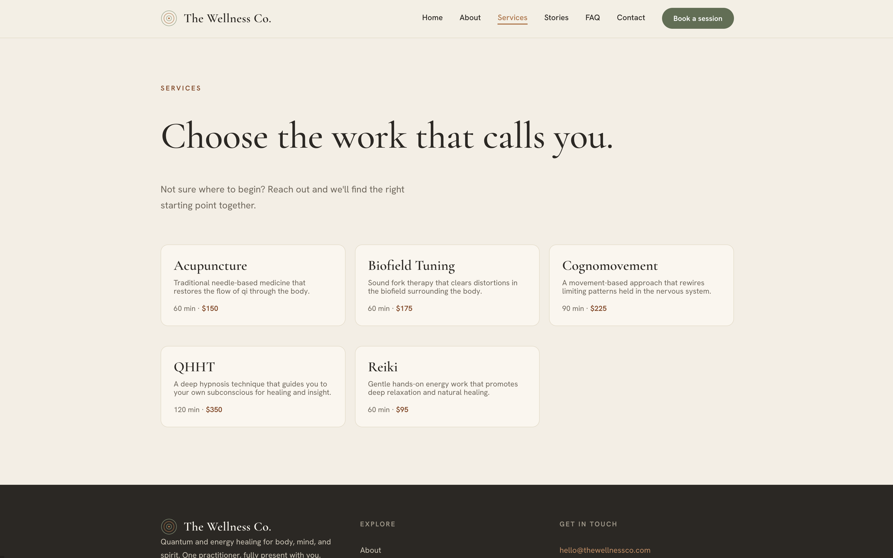
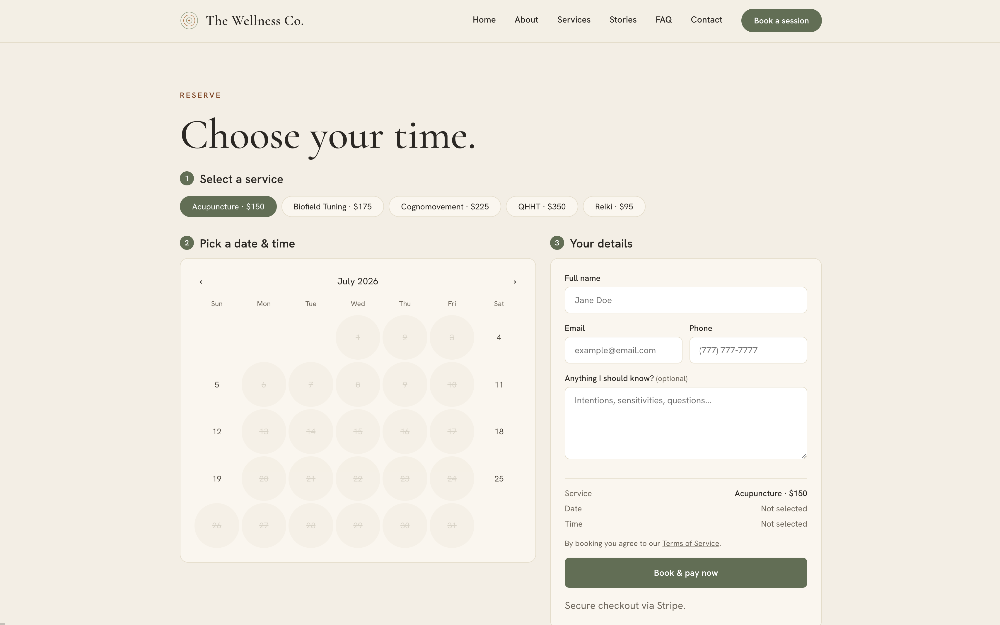
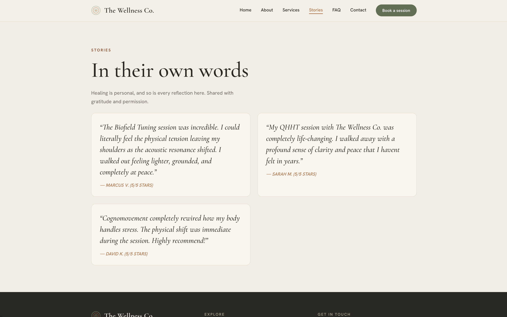
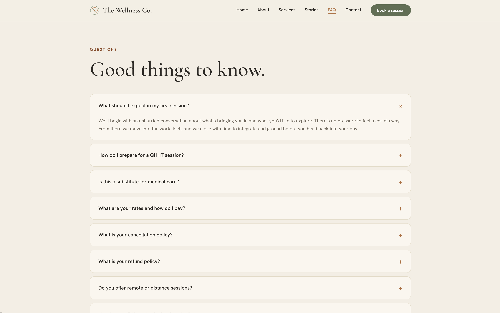
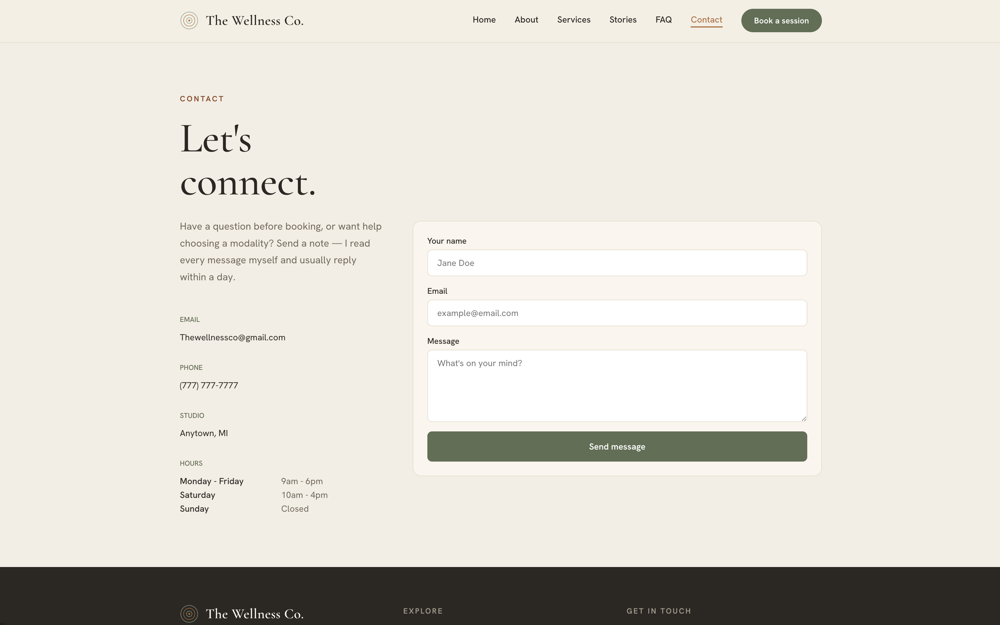

# The Wellness Co.

A full-stack, multi-tenant booking platform for wellness and energy healing practices. Clients can browse services, book appointments, and pay securely through Stripe. Practitioners manage everything through a password-protected admin dashboard.

Built as a learning project while transitioning from Swift/SwiftUI to web development.

## Screenshots

| | |
|---|---|
|  |  |
|  |  |
|  |  |
|  | |

## Stack

**Frontend**
- HTML, CSS, JavaScript (vanilla)
- Mobile-first responsive design

**Backend**
- Node.js + Express
- Supabase (PostgreSQL) for the database
- Stripe for payment processing and refunds
- Resend for transactional email
- Helmet for security headers
- express-rate-limit for API protection

**Deployed on Vercel**

## Pages

| Page | Description |
|---|---|
| `index.html` | Home — hero, services grid, meet the practitioner, testimonials |
| `about.html` | Practitioner bio, training, certifications |
| `services.html` | Full service list with pricing and booking links |
| `appointments.html` | Booking flow — service, date, time, personal details |
| `confirmation.html` | Post-booking confirmation |
| `cancel.html` | Self-serve cancellation and reschedule flow |
| `contact.html` | Contact form |
| `faq.html` | FAQ accordion |
| `stories.html` | Client testimonials |
| `admin.html` | Password-protected admin dashboard |
| `privacy.html` | Privacy policy |
| `terms.html` | Terms of service |

## API Routes

| Method | Route | Description |
|---|---|---|
| GET | `/api/services` | Fetch active services |
| GET | `/api/availability?date=YYYY-MM-DD` | Available time slots for a date |
| POST | `/api/appointments` | Initiate Stripe checkout |
| POST | `/api/webhook` | Stripe webhook — saves appointment and sends confirmation email |
| GET | `/api/cancel?token=` | Load appointment details for cancellation |
| POST | `/api/cancel` | Cancel appointment and issue refund |
| POST | `/api/reschedule` | Reschedule appointment and issue full refund |
| POST | `/api/contact` | Submit contact form |
| POST | `/api/login` | Admin login via Supabase Auth |
| POST | `/api/reset-password` | Send password reset email |
| POST | `/api/update-password` | Set new password via reset token |
| GET/PUT | `/api/settings/footer` | Footer content |
| GET/PUT | `/api/settings/availability` | Weekly availability schedule |
| GET/PUT | `/api/settings/integrations` | Per-tenant Stripe and Resend keys |
| GET/PUT | `/api/blocked-dates` | Admin-blocked dates |
| GET/POST | `/api/reviews` | Client reviews with admin approval |

## Local Setup

```bash
# Install dependencies
npm install

# Create a .env file with the following:
SUPABASE_URL=
SUPABASE_SERVICE_ROLE_KEY=
SUPABASE_ANON_KEY=
STRIPE_SECRET_KEY=
STRIPE_WEBHOOK_SECRET=
RESEND_API_KEY=
TENANT_SLUG=the-wellness-co

# Start the server
node server.js
```

The server runs on `http://localhost:3000` by default.

## Environment Variables

| Variable | Description |
|---|---|
| `SUPABASE_URL` | Supabase project URL |
| `SUPABASE_SERVICE_ROLE_KEY` | Supabase service role key |
| `SUPABASE_ANON_KEY` | Supabase anon key (used for auth) |
| `STRIPE_SECRET_KEY` | Stripe secret key |
| `STRIPE_WEBHOOK_SECRET` | Stripe webhook signing secret |
| `RESEND_API_KEY` | Resend API key for transactional email |
| `TENANT_SLUG` | Slug identifying which tenant to load (e.g. `the-wellness-co`) |

## Database Setup

Run the migration files in order against your Supabase project:

```
migrations/001_create_tables.sql
migrations/002_add_missing_tables.sql
```

Then insert a tenant row:

```sql
INSERT INTO public.tenants (name, slug, vertical, owner_email, contact_email)
VALUES ('Your Business', 'your-slug', 'wellness', 'owner@yourdomain.com', 'info@yourdomain.com');
```

## Multi-Tenant Architecture

Each deployment is scoped to a single tenant via the `TENANT_SLUG` environment variable. All database queries are filtered by `tenant_id`, so multiple tenants can share the same Supabase instance and API server safely. To onboard a new client, insert a tenant row and deploy a new Vercel project with their `TENANT_SLUG`.
